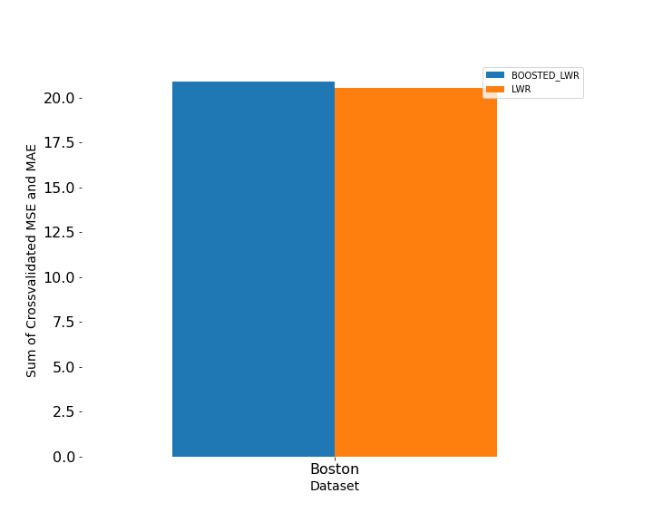

# Project 3
This page investigates the theoretical advantages and disadvantages of multivariate regression analysis and boosting algorithims, and describes the analysis completed on the cars and Boston housing datasets using each of the methods. 

# Theroetical Discussion

## Multivariate Regression Analysis

The biggest difference between Multivariate and Univariate Regression Analysis is the number of features in the input data. For Univariate Regression, only one features is used, but in Multivariate Regression multiple features (2+) are used for the input data. This means the following equation still holds:

<p align="center">
    
</p>

But the major difference is that X consists of multiple features, so it can be written as:

<p align="center">
    
</p>

Where X consists of the features, y is the dependent variable, and beta represents the weights. The goal is to find the weights that optimize this equation and minimize the amount of error. In the studies presented below, I used the sum of mean squared error (MSE) and mean absolute error (MAE) to measure the effectiveness of the weight parameters. One important thing to note is that

<p align="center">

</p>
So this term can be ignored when solving for the weights in the Locally Weighted Regression. This is intended to describe the changes that occur when working with Multivariate data, so for an in-depth discussion on how Locally Weighted Regression works please see the `Theoretical Discussion` section on my [Project2 page](https://bswhitneywm.github.io/Data410-Project2)

## Gradient Boosting

Gradient Boosting is a process that can be used to try and improve the accuracy of learners in regression and classification problems. While it is possible to apply it to ranking problems as well, this is extremely difficult. For the purposes of discussion on this page, we will assume Gradient Boosting is being used in a regression context. At a high level, Gradient Boosting revolves around improving a regressor **F** for the observations of X (where X = X1, X2, ..., Xn). For the regressor, predictions can be represented as: 
<p align="center">

</p>

**One of the key assumptions for Gradient Boosting is that regressor F is regarded as a "weak learner"**. In machine learning, a weak learner is used to describe models that are only slightly better than randomly guessing. On the other hand, strong learners describe models that are more (arbitrarily) accurate in their predictions. To counteract the weak learner, you can train a decision tree **h** such that the new output is:
<p align="center">

</p>

By adding **F** to both sides...
<p align="center">

</p>

This leads to a new regressor that is defined by **F + h**. It has been shown that the new regressor **F + h** is more liekly to perform better than the old regressor **F**. This stems from the idea that multiple weak learners combined together can create a single strong learner.  

## Extreme Gradient Boosting (XGBoost)


XGBoost is similar to Gradient Boosting in the fact it tries to combine weak learners to make a strong learner in the end. Unlike Gradient Boosting, it uses regularization parameters to prevent overfitting, such as the learning rate. For the initial weak learner, XGBoost just makes arbitrary predictions, such as the average of all the values, and calculates the residuals.

**Redisuals = Actual Value - Predicted Value**

Once the residuals are calculated, it is time to determine the best linear split along the features. A split will result in a decision tree with a conditional in the root and all the residuals to the left of the split in the left leaf node and all the other residuals in the right leaf node. To compare splits, the improvement in accuracy brought by each split is calculated using the idea of Gain. The formula is below:
<p align="center">

</p>
Where  

**G_L = sum of residuals in left leaf**  
**G_R = sum of residuals in right leaf**  
**H_L = # of residuals in left leaf**  
**H_R = # of residuals in right leaf**  
**Lambda = Hyperparameter to control the sensitivity to individual observations**  
**Gamma = Hyperparameter controlling the minimum loss reduction required to make a further partition on a leaf node of the tree**  


The goal is to choose the split that maximizes the gain, as this will lead to the split that increases the accuracy the most. A negative gain indicates the split does not improve results compared to leaving the tree untouched. This process is repeated on both of the leaves until a tree is created where no more increases in accuracy can be made. In other words, until all the splits at a given leaf node result in neative gain. Once this happens, we are left with a decision tree that can be used for prediction. Since the leaves contain residuals and predictions must return a single scalar value, they are calculated with the following formula where **r**. 
<p align="center">

</p>

New predictions are then made with the following formula, which are used to create a set of new residuals. 

**Prediction = Initial Prediction + Leanring Rate * Prediction**

We repeat the same process described above with the new residuals to create a new decision tree. This process is repeated a number of times (until the max number is reached or by default 100) to produce a stronger learner. This is because a bunch of weak learners with slow improvements will combine to make a strong learner with accurate predictions in the end. At the end, the XGBoost model makes predictions by summing the initial predictions and the predictions made by each individual tree multipled by the learning rate.
# Analysis

## Cars Dataset

For the cars dataset I used used the `ENG, CYL, WGT` variables as the independent variables and `MPG` as the dependent variable. 
```python
cars = pd.read_csv('Data/cars.csv')
Xcars = cars[['ENG', 'CYL', 'WGT']].values
ycars = cars['MPG'].values
``` 

### Functions Defined
I decided to use the three kernels that we have been exploring in class (Tricubic, Epanechnikov, and Quartic) for the Locally Weighted Regression. I didn't make any changes to these kernels and were defined as follows: 

```python
def Tricubic(x):
    if len(x.shape) == 1:
        x = x.reshape(-1,1)
    d = np.sqrt(np.sum(x**2,axis=1))
    return np.where(d>1,0,70/81*(1-d**3)**3)

def Quartic(x):
    if len(x.shape) == 1:
        x = x.reshape(-1,1)
    d = np.sqrt(np.sum(x**2,axis=1))
    return np.where(d>1,0,15/16*(1-d**2)**2)

def Epanechnikov(x):
    if len(x.shape) == 1:
        x = x.reshape(-1,1)
    d = np.sqrt(np.sum(x**2,axis=1))
    return np.where(d>1,0,3/4*(1-d**2)) 
```

In terms of the Locally Wieghted Regresison and Boosted Regression, I also used the functions defined in class and past lectures. This way I knew the functions worked properly and could focus on other aspects such as paramter scanning, feature selection, and error analysis throughout the project. 

```python
def lw_reg(X, y, xnew, kern, tau, intercept): 
    n = len(X) # the number of observations
    yest = np.zeros(n)
    if len(y.shape)==1: # here we make column vectors
        y = y.reshape(-1,1)
    if len(X.shape)==1:
        X = X.reshape(-1,1)
    if intercept:
        X1 = np.column_stack([np.ones((len(X),1)),X])
    else:
        X1 = X
    w = np.array([kern((X - X[i])/(2*tau)) for i in range(n)]) # here we compute n vectors of weights

    for i in range(n):          
        W = np.diag(w[:,i])
        b = np.transpose(X1).dot(W).dot(y)
        A = np.transpose(X1).dot(W).dot(X1)
        beta, res, rnk, s = lstsq(A, b)
        yest[i] = np.dot(X1[i],beta)
    if X.shape[1]==1:
        f = interp1d(X.flatten(),yest,fill_value='extrapolate')
    else:
        f = LinearNDInterpolator(X, yest)
    output = f(xnew) # the output may have NaN's where the data points from xnew are outside the convex hull of X
    if sum(np.isnan(output))>0:
        g = NearestNDInterpolator(X,y.ravel()) 
        output[np.isnan(output)] = g(xnew[np.isnan(output)])
    return output

def boosted_lwr(X, y, xnew, kern, tau, intercept):
    Fx = lw_reg(X,y,X,kern,tau,intercept) # we need this for training the Decision Tree
    new_y = y - Fx
    tree_model = DecisionTreeRegressor(max_depth=2, random_state=123)
    tree_model.fit(X,new_y)
    output = tree_model.predict(xnew) + lw_reg(X,y,xnew,kern,tau,intercept)
    return output  
```

Data was split into training and testing splits to be used in determining the best hyperparamters for the Locally Weighted Regression. I used a `random_state = 13` to ensure my results were reproducible. The `test_size` was set to 0.25, so 75% of the observations would be used to train the model and 25% would be used to validate the results. The code for this is shown below: 

```python
# Split the data for parameter selection
Xtrain_cars, Xtest_cars, ytrain_cars, ytest_cars = tts(Xcars, ycars, test_size=0.25, random_state=13)
Xtrain_boston, Xtest_boston, ytrain_boston, ytest_boston = tts(Xboston, yboston, test_size=0.25, random_state=13)
```

### Regression Analysis

The first step I took was to determine the best hyperparameters for both the Locally Weighted Regression and Boosted Lowess Regression. In particular, I decided to investigate the ideal kernel and tau values. For the kernels, Tricubic, Epanechnikov, and Quartic were the three options. For the tau value, I checked every value between 0.1 and 2.1 (Exclsuive) incrementing by 0.1 each time. To determine the best hyperparameters, I calculated the MSE and MAE for every combination of the kernel and tau for each method. If the sum of the MSE and MAE for the method (i.e. Locally Weighted Regression or Boosted Lowess Regression) was smaller than the current lowest score, the current kernel and tau value would be saved as the ideal parameters. I chose to use the sum of the MSE and MAE instead of either one individually because both values are used in evaluating the success of the Locally Weighted Regression and Boosted Lowess Regression, so they should both play a role in determining the hyperparamters. While a small nuance, it is important to note that I normalized the input data, as it is usually best practice when performing regressions. The code for the hyperparmeter selection is shown below. 

```python
# Parameters to scan
kernels = [Tricubic, Epanechnikov, Quartic]
taus = np.arange(0.1, 2.1, 0.1)

# Save MSE and MAE
best_params_lwr = tuple()
best_params_boost = tuple()
best_sum_lwr = 10**5
best_sum_boost = 10**5

#Scale the data
scale = StandardScaler()
Xtrain_cars_ss = scale.fit_transform(Xtrain_cars)
Xtest_cars_ss = scale.transform(Xtest_cars)

# Perform analysis
for kern in kernels:
    for tau in taus:
        # Locally Weighted Regression
        ypred_cars_lwr = lw_reg(Xtrain_cars_ss, ytrain_cars, Xtest_cars_ss, kern=kern, tau=tau, intercept=True)
        mse_lwr = mean_squared_error(ytest_cars, ypred_cars_lwr)
        mae_lwr = mean_absolute_error(ytest_cars, ypred_cars_lwr)
        
        # Boosted Locally Weighted Regression
        ypred_cars_boost = boosted_lwr(Xtrain_cars_ss, ytrain_cars, Xtest_cars_ss, kern=kern, tau=tau, intercept=True)
        mse_boost = mean_squared_error(ytest_cars, ypred_cars_boost)
        mae_boost = mean_absolute_error(ytest_cars, ypred_cars_boost)
        
        if(mse_lwr + mae_lwr < best_sum_lwr):
            best_sum_lwr = mse_lwr + mae_lwr
            best_params_lwr = (kern, tau)
            
        if(mse_boost + mae_boost < best_sum_boost):
            best_sum_boost = mse_boost + mae_boost
            best_params_boost = (kern, tau)

print(f'Best parameters for LWR are kern = {best_params_lwr[0]} and tau = {best_params_lwr[1]} for the Cars Dataset') 
print(f'Best parameters for Boosted LWR are kern = {best_params_boost[0]} and tau = {best_params_boost[1]} for the Cars Dataset') 
```
This produced the following results:
- Best Locally Weihted Regression Hyperparameters: **kernel: Epanechnikov, tau: 0.8**
- Best Boosted Lowess Regression Hyperparamters:   **kernel: Tricubic,     tau: 0.5**

Next I took these parameters and used them in crossvalidation to determine the crossvalidated MSE and MAE of the cars dataset for both the Locally Weighted Regression and Boosted Lowess Regression. I chose to perform 5 splits in the crossvalidation because I wanted to ensure there were sufficient observations in each fold. I chose to shuffle the data and provide a random state so the order which data was entered into the file didn't play a role, but the results would still be reproducible after a random shuffle of the data. I made sure to scale the input data everytime to ensure best practice, and the implementation of crossvalidation is shown below. 

```python
# Perform Crossvalidation
kf = KFold(n_splits=5, shuffle=True, random_state=410)

# Save mse and mae
mse_lwr_cars = []
mae_lwr_cars = []
mse_boost_cars = []
mae_boost_cars = []
for idxTrain, idxTest in kf.split(Xcars):
    Xtrain, Xtest = Xcars[idxTrain], Xcars[idxTest]
    ytrain, ytest = ycars[idxTrain], ycars[idxTest]
    
    # Scale the data
    Xtrain_ss = scale.fit_transform(Xtrain)
    Xtest_ss = scale.transform(Xtest)
    
    # Locally Weighted Regression
    ypred_lwr = lw_reg(Xtrain_ss, ytrain, Xtest_ss, kern=best_params_lwr[0], tau=best_params_lwr[1], intercept=True)
    mse_lwr_cars.append(mean_squared_error(ytest, ypred_lwr))
    mae_lwr_cars.append(mean_absolute_error(ytest, ypred_lwr))
    
    # Boosted Locally Weighted Regression
    ypred_boost = boosted_lwr(Xtrain_ss, ytrain, Xtest_ss, kern=best_params_boost[0], tau=best_params_boost[1], intercept=True)
    mse_boost_cars.append(mean_squared_error(ytest, ypred_boost))
    mae_boost_cars.append(mean_absolute_error(ytest, ypred_boost))

# Print results
print("Crossvalidated LWR MSE for cars dataset", np.mean(mse_lwr_cars))
print("Crossvalidated LWR MAE for cars dataset", np.mean(mae_lwr_cars))
print("Crossvalidated Boosted LWR MSE for cars dataset", np.mean(mse_boost_cars))
print("Crossvalidated Boosted LWR MAE for cars dataset", np.mean(mae_boost_cars))
```

Crossvalidation prodcued the following Results:
- Locally Weighted Regression: **MSE: 16.994, MAE: 3.005**
- Boosted Lowess Regression:   **MSE: 17.770, MAE: 3.055**

### Cars Results
To determine the effectiveness for the two methods on the dataset I decided to look at the sum of the MSE and MAE for each regression algorithm. The Locally Weighted Regression had a total of **19.999** while the Boosted Lowess Regression had a total of **20.825**. This suggests that the Locally Weighted Regression is slightly more competitive than the Boosted Lowess Regression for the Cars dataset. This was a surprising result, but could have resulted from a number of factors that are discussed later in the `Conclusion` section. Below is a graphical representation of the MSE and MAE totals for each regression method. 

<p align="center">
  
</p>

## Boston Housing Dataset

For the Boston Housing dataset, the same functions and kernels that were defined for the Cars dataset were used for analysis of the Boston Housin dataset. Again, the data was split into a training sample with 75% of the bservations and a testing set with 25% of the observations to be used for determining the ideal hyperparameters for the data. If you have any questions about these, please see the `Functions Defined` section above. 

### Feature Selection

I made the executive decision to remove some features from the Boston Housing data analysis. In particular, I removed *Longitude*, *Latitude*, *Town*, and *Tract*. I also decided to change *river* from yes/no to 0/1 values. My explanation for each decision and the code implementation are shown below:
- Longitude/Latitude: While it is a number, the number is a location and only has significant meaning when put into the context of the earth. 
- Town: This is categorical data and would be extremely difficult to convert into numerical data. While it probably contributes to the price of houses, it is very difficult to use in regressions. 
- Tract: Similar to *Town*, this is more categorical data that is extremely difficult to implement into regression algorithms. 
- River: I think having a river nearby could impact the price of houses. Since there are only 2 possibel values (yes/no), I decided to map them to 1/0 so the variable could be implemented in the regression. 

```python
# Import Boston Housing dataset
boston = pd.read_csv('Data/Boston Housing Prices.csv')

# Remove or convert categorical data 
Xboston = boston.drop(columns=['longitude', 'latitude', 'town', 'tract', 'cmedv'])
Xboston['river'] = Xboston['river'].map({'yes':1, 'no': 0})
Xboston = Xboston.values

yboston = boston['cmedv'].values
```
### Regression Analysis
The first step was to determine the best hyperparameters for both the Locally Weighted Regression and the Boosted Lowess Regression. These hyperparameters were then used to calculate the crossvalidated MSE and MAE. For crossvalidation 5 splits were used again to ensure sufficient observations in every fold. The data was first shuffled to ensure the order of data entry didn't play a role in the results, but a random state was also used to ensure reproducible results. Since this process was the same as I used for the Cars dataset, please see the `Regression Analysis` section under the Cars dataset for a detailed look at the code. The only difference between the two is the data that was used. 

Crossvalidation prodcued the following Results:
- Locally Weighted Regression: **MSE: 17.893, MAE: 2.664**
- Boosted Lowess Regression:   **MSE: 18.261, MAE: 2.648**

### Boston Results
To determine the effectiveness for the two methods on the Boston dataset I again decided to look at the sum of the MSE and MAE for each regression algorithm. The Locally Weighted Regression had a total of **20.557** while the Boosted Lowess Regression had a total of **20.909**. This suggests that the normal Locally Weighted Regression is performing slightly betetr on the Boston Housing dataset than the boosted version. This is emphasized in the graphical representation below as well. Potential reasons for this are discussed in the `Conclusion` section. 

<p align="center">
  
</p>

# Final Results
As a reminder, the project produced the following results:

Cars dataset:
- Locally Weighted Regression: **MSE: 16.994, MAE: 3.005**
- Boosted Lowess Regression:   **MSE: 17.770, MAE: 3.055**


Boston Housing dataset:
- Locally Weighted Regression: **MSE: 17.893, MAE: 2.664**
- Boosted Lowess Regression:   **MSE: 18.261, MAE: 2.648**

One of the most interesting things I found is that the Boston Housing dataset produced a larger MSE than the Cars dataset in both cases, but at the same time produced a smaller MAE in both cases. This ins't unheard of since MSE and MAE are different metrics, but I believe it highlights the importance of choosing a good cost function. In the case of the Boston Housing data, optimizing for MSE would suggest the Locally Weighted Regression performs better, while optimizing for MAE would suggest the Boosted Lowess Regression is slightly more effective for the data. I decided to look at the sum of the MSE and MAE for analyzing the effectiveness of the regression methods, and the results are shown in the graph below. **For this particular project where I decided to try and minimize the sum of the MSE and MAE values, the Locally Weighted Reression without Boosting appears to be performing the best**.

<p align="center">
  
</p>


# Conclusion

Based on my theoretical expectations and the results we have seen in class, I was surprised to see the normal Locally Weighted Regression performing as well and betetr than the Boosted Lowess Regression in most cases. The choice of a cost function is important, as trying to minimize the MAE would indicate the Boosted Lowess Regression performed better on the Boston Housing data; However, this was the only metric where Boosted Lowess Regression outperformed the Locally Weighted Regression. These shocking results showcase that there are no universal laws when it comes to data science. Although we may expect a given method to perform better than another in most situations, you can never be sure until you test them out on the data. The variation between datasets and their properties mean some methods will perform betetr on certain datasets and worse on others, so it is always important to test multiple methods on data and see which one is producing the best results. It is entirely possible that the Locally Wieghted Regression is the best method for these datasets, but there also some other potential reasons that require more in-depth analysis that could explain the unexpected results:

- *Locally Weighted Regression Learning Strength*: It is possible that the Locally Weighted Regression can be considered a strong learner in the case of these data sets. We know that Gradient Boosting is very effective fr improving the accuracy of weak learners, but when it comes to strong learners Gradient Boosting may only lead to the model becoming overfit. Overfitting will ultimately lead to worse results because it will perform poorly on the testing sets. This would require some more in-depth analysis to confirm or deny this hypothesis.  
- *Feature Selection*: For the Boston Housing data I removed some features that may have contributed to the price of houses such as the location of the house (Whether it be Longitude/Latitude or the Town). Perhaps including these features in the analysis would produce slihtly different results, or removing more features that don't contribute as much. I chose the features to use based on what I felt made sense and didn't require tons of data manipulation, but there are far more advanced feature selection techniques I could have explored if there was more time. 
- *Randomness*: It is always possible that Random Seeds impact the results of experiments. They have the reat beenfit of making the work reproducible, but the choice of the random seed can have a big impact. Choosing a different random seed would result in different crossvalidated MSE and MAE values, and maybe change how well either of the regression methods perform. In an ideal world, I would test multiple different random seeds and average the results together for even stronger results. 

There are many more factors and validation techniques that I could use to strengthen the results of the experiment, but their simply isn't enough time to go in-depth with every potential error source. **There is no denying that Locally Weighted Regression outperformed the Boosted Lowess Regression in this project with the Cars and Boston Housing data. However, this does not mean that boosting is useless and will perform worse than the normal Locally Weighted Regression in every scenario. The only was to find out for sure is to test the two methods on the individual data you will be exploring**.  
